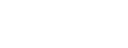

Place your fonts here.

Supported formats:
- Bitmap Font (*.fnt)
- PNG + JSON: 
  - PNG image with glyphs (white on transparent is recommended).
  - JSON file describing tiles size and characters used in the font

Example:

`kernal.png`:



`kernal.json`:
```json
{
  "bitmap": "kernal.png",
  "tileWidth": 8,
  "tileHeight": 8,
  "characters": " !\"#$%&'()*+,-./0123456789:;<=>?@ABCDEFGHIJKLMNOPQRSTUVWXYZ[\\]↑_✓abcdefghijklmnopqrstuvwxyz£|←▒▓"
}
```
